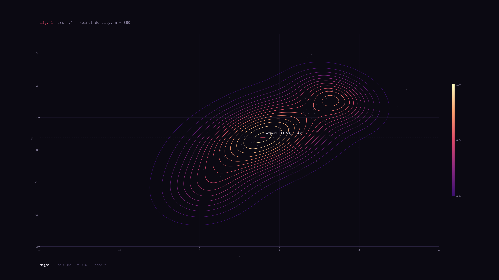

# Avionic

A themed Hyprland desktop for Arch Linux. Two themes ship out of the box:

- **Magma** (default) — a live notebook cell. Violet-black base, matplotlib's magma heat ramp (deep purple → rose → pale yellow), IBM Plex Mono everywhere. Every number on the bar is drawn as a small plot.
- **Avionic** — a cockpit instrument panel. Dark graphite, 1px rules, square corners, no blur, and one amber readout: the active workspace and the focused window.

The bar is a custom [Quickshell](https://quickshell.org) strip. Switch themes any time with `scripts/theme.sh`.



## Install

```sh
curl -fsSL https://raw.githubusercontent.com/AlfaPigeon/avionic/main/install.sh | bash
```

That installs **Magma**. Pass options after `bash -s --`:

```sh
curl -fsSL https://raw.githubusercontent.com/AlfaPigeon/avionic/main/install.sh | bash -s -- --theme avionic --sddm --shell fish
```

| Option | What it does |
| --- | --- |
| `--theme NAME` | `magma` (default) or `avionic`. Switch later with `scripts/theme.sh` |
| `--no-packages` | Skip pacman/AUR. Only link configs and apply the theme |
| `--sddm` | Install and enable SDDM (off by default) |
| `--waybar` | Use Waybar as the bar instead of Quickshell (installs `waybar`, links its config, autostarts it) |
| `--wlogout` | Use wlogout (AUR) as the power menu instead of the built-in rofi one |
| `--shell fish\|zsh` | Install that shell and make it your login shell (off by default) |
| `--dry-run` | Print every step, change nothing |
| `-y`, `--yes` | Accept defaults without asking |

> **Heads-up:** the package step runs `sudo pacman -Syu --needed …`, so it **upgrades your whole system** before installing (Arch does not support partial upgrades). Use `--no-packages` to skip it, or `--dry-run` to see every command first.

The installer refuses to run as root and checks for pacman. It installs from the official repos only, clones the repo to `~/.local/share/avionic` (or updates it), backs up existing configs to `~/.local/state/avionic/backups/<timestamp>/`, and symlinks ours into `~/.config`, so `git pull` updates them. It also enables PipeWire, NetworkManager and Bluetooth. You can run it again safely.

Start the desktop with `start-hyprland` on a TTY, or pick **Hyprland** in SDDM.

## Themes

```sh
~/.local/share/avionic/scripts/theme.sh list
~/.local/share/avionic/scripts/theme.sh magma      # or avionic
```

The choice is saved in `~/.local/state/avionic/theme`. `AVIONIC_THEME` overrides it. Each theme is a folder under `themes/<name>/`:

```
themes/<name>/
  palette.sh        colors, fonts, sizes, wallpaper path, which bar layout to draw
  wallpaper.png     Designer's wallpaper (also the lock screen background)
```

`scripts/apply-theme.sh` (or `theme.sh`) renders every `templates/<app>/<file>.tmpl` into `config/<app>/<file>`. Rendered files are git-ignored. Templates use:

- `{{name}}` for any palette value, for example `{{font_ui}}` or `{{radius}}`
- `{{color}}` → `#0b0912`, `{{color.hex}}` → `0b0912`, `{{color.rgb}}` → `11, 9, 18`

Unknown placeholders and malformed colors fail loudly. `--check` renders into a temp dir as a dry run (and with no `--theme` it checks every theme). To restyle a component, edit its template. To recolor everything, edit only that theme's palette.

The Quickshell bar also has a layout per theme under `config/quickshell/themes/<name>/` (shared pieces — tray, power, readouts, calendar, workspace switching, `/proc` stats — live next to `shell.qml`). The palette's `bar=` picks which one to draw.

### Magma (default)

| Role | Key | Value |
| --- | --- | --- |
| Background | `bg` | `#0B0912` |
| Bar / panels | `bg_alt` | `#100D1A` |
| Surface | `surface` | `#181426` |
| Border (every rule) | `overlay` | `#2A2340` |
| Text / secondary / muted | `fg` / `fg_dim` / `muted` | `#ECE6F2` / `#B9B1C9` / `#8A82A0` |
| Rose accent (focused border, focused app name, cpu sparkline) | `accent` | `#DE4968` |
| Info, used sparingly | `accent_alt` | `#9A7BFF` |
| Off the scale (urgent, critical) | `urgent`, `warning` | `#FCFDBF` |
| Data ramp, low → high | `ramp_0`…`ramp_5` | `#2A2340` → `#3B0F70` → `#8C2981` → `#DE4968` → `#FE9F6D` → `#FCFDBF` |
| Fonts | `font_ui`, `font_mono`, `font_term` | IBM Plex Mono everywhere; JetBrainsMono Nerd Font in the terminal |
| Shape | `radius`, `border` | `0`, `1` |

### Avionic

| Role | Key | Value |
| --- | --- | --- |
| Background | `bg` | `#0C0E11` |
| Bar / panels | `bg_alt` | `#101317` |
| Surface | `surface` | `#15191E` |
| Border (every rule) | `overlay` | `#232A31` |
| Text / secondary / muted | `fg` / `fg_dim` / `muted` | `#E8E4DA` / `#B1B4B4` / `#7A848F` |
| Amber accent (active workspace, focused border) | `accent` | `#FFB347` |
| Info, used sparingly | `accent_alt` | `#7FB7D9` |
| Warning / urgent | `warning`, `urgent` | `#F25C54` |
| Fonts | `font_ui`, `font_mono` | IBM Plex Sans, JetBrainsMono Nerd Font |
| Shape | `radius`, `border` | `0`, `1` |

## Targets

Built for **Hyprland 0.56.2**, which uses the **Lua config** (`hyprland.lua`). The old `hyprland.conf` format is deprecated. Hyprland-side syntax used here:

- `hl.window_rule` / `hl.layer_rule` with `match = { … }` (not `windowrulev2`)
- `hl.gesture({ fingers = 3, direction = "horizontal", action = "workspace" })` (not `workspace_swipe`)
- `hyprctl dispatch 'hl.dsp.dpms({ action = "off" })'` (Lua dispatchers) in hypridle and the power menu
- Quickshell detects the Lua config: on start it asks Hyprland `j/status`, sees `"configProvider": "lua"`, and from then on `HyprlandWorkspace.activate()` sends `hl.dsp.focus({ workspace = "N" })` instead of the old `workspace N`. This landed in Quickshell 0.3.0; Arch ships 0.3.1 in `extra`. The bar uses that for existing workspaces and builds the same Lua dispatch itself for empty ones and for scrolling (`"e+1"` / `"e-1"`).
- The `--waybar` fallback uses Waybar's generic `ext/workspaces` module, because Waybar 0.15's `hyprland/workspaces` still sends old-style dispatches that the Lua config rejects (clicking a workspace would do nothing). Once a Waybar release ships the Lua-compatible fix, switch back to `hyprland/workspaces` in `config/waybar/config.jsonc` (the CSS already targets `#workspaces`).

The other tools are Quickshell 0.3.1, hyprlock 0.9, hypridle 0.1.8, hyprpaper 0.8 (`wallpaper { }` blocks), hyprpolkitagent 0.2, Waybar 0.15 (optional), rofi 2.0 (native Wayland), swaync 0.12 and swayosd 0.3.

## What's included

| Area | Tool |
| --- | --- |
| Compositor | Hyprland, xdg-desktop-portal-hyprland + gtk, hyprpolkitagent |
| Bar | Quickshell (default, see below) or Waybar with `--waybar` |
| Launcher, menus | rofi: apps, clipboard, power menu, keybind list |
| Notifications | swaync (SUPER + N) |
| On-screen display | swayosd for volume and brightness keys |
| Lock & idle | hyprlock + hypridle: dim 2.5 min, lock 5 min, screen off 5.5 min, suspend 30 min |
| Wallpaper | hyprpaper, Designer's wallpaper from the active theme (also the lock screen background) |
| Terminal | kitty |
| Files | Thunar (+ gvfs, archive and volume plugins) |
| Screenshots | grim + slurp, swappy for edits, saved to `~/Pictures/Screenshots` and copied |
| Clipboard | cliphist + wl-clipboard |
| Color picker | hyprpicker |
| Media | playerctl, brightnessctl, wpctl/WirePlumber, pavucontrol |
| Network | NetworkManager + nm-applet, BlueZ + Blueman |
| Look | GTK (adw-gtk3 + nwg-look), Qt (qt6ct, qt5/qt6-wayland), Papirus icons, fonts from the active theme |

## The bar

`config/quickshell/` is a small Quickshell config (plain QML, no scripts) that draws one 32px bar per screen. The layout comes from the active theme.

### Magma

```
λ magma │ [1][2][3][4][5][6][7][8][9] n_win │ kitty ~/projects     t = 11:48:21  2026-10-08     cpu ⟋⟍⟋• 23  mem ▂▄▆█▅▃ 41  bat ▬▬▬▭ 78 │ net wlan0  vol 62 │ ▫ ▫ ▫ │ ⏻
```

| Part | What it shows | Mouse |
| --- | --- | --- |
| Prompt | A rose `λ` and the `magma` wordmark | |
| Heatmap | Workspaces 1–9 as 22×20 cells coloured by window count on the magma ramp (empty = outline only), plus a cell for any workspace above 9 that exists. The active one gets a text-coloured outline; urgent ones are filled hot. Followed by an `n_win` legend | Click to switch, scroll for next/previous |
| Window title | The focused app class in rose, then the title in secondary text | |
| Clock | `t = HH:MM:SS` and the ISO date, on the true centre of the screen | Click for a month calendar |
| Plots | A cpu sparkline of the last 30 samples, a mem histogram of the last 8 readings, and a bat bar (hidden without a battery; hot below 15%) | Click opens btop |
| Network | `net` and the connected interface, or `off` (NetworkManager) | Click for nm-connection-editor |
| Audio | `vol` and the default output volume, or `mute` (PipeWire) | Scroll to change, right-click to mute, click for pavucontrol |
| Bluetooth | `bt` and the number of connected devices, only while something is connected | Click for blueman |
| Notifications | `msg` and the swaync count, only while there are notifications or do-not-disturb is on | Click toggles the panel, right-click do-not-disturb |
| Tray | StatusNotifier icons, tinted monochrome | Click activates, right-click opens the app menu |
| Power | Power button in its own square | Click for the power menu |

Rose is the accent (focused border, focused app name, cpu sparkline). Pale yellow is reserved for urgent and critical states.

### Avionic

```
— AVIONIC │ 01 [02] 03 04 05 06 07 08 09 │ kitty  ·  ~/projects     THU 08 OCT ╎╎╎│ 10:48:21 │╎╎╎ UTC+3     ◜ CPU 23 ◜ MEM 41 ◜ BAT 78 │ NET wlan0  VOL 62 │ ▫ ▫ ▫ │ ⏻
```

| Part | What it shows | Mouse |
| --- | --- | --- |
| Mark | An amber dash and the `AVIONIC` wordmark | |
| Heading tape | Workspaces 01–09 on a tick ruler (plus a cell for any workspace above 9 that exists). The active one on that screen gets an amber top line, amber number and an amber caret; occupied ones are in text color, empty ones muted, urgent ones red | Click to switch, scroll for next/previous |
| Window title | The focused window as `class  ·  title` | |
| Clock | Date, tick rulers, `HH:MM` with dimmed `:SS`, and the UTC offset, on the true centre of the screen | Click for a month calendar |
| Gauges | Small 270° rings followed by `CPU` and `MEM` (from `/proc`) and `BAT` (UPower, hidden on desktops). Red when CPU or memory is above 90% or the battery below 15%; the battery ring is green while charging | Click opens btop |
| Network / Audio / Bluetooth / Notifications / Tray / Power | Same behaviour as Magma, with Avionic's uppercase labels and colours | |

Amber is used only for the mark and the active workspace. Colors and fonts come from `config/quickshell/Theme.qml`, which `apply-theme.sh` generates from the palette. `scripts/bar.sh start|restart|reload` starts whichever bar you chose (recorded in `~/.local/state/avionic/bar`; `AVIONIC_BAR=waybar` overrides it). Quickshell also reloads by itself when its files change.

## Keybinds

`SUPER + F1` shows every bind in a searchable list.

| Keys | Action |
| --- | --- |
| `SUPER + Return` | Terminal |
| `SUPER + Space` | App launcher |
| `SUPER + E` | File manager |
| `SUPER + V` | Clipboard history |
| `SUPER + N` / `SUPER + SHIFT + N` | Notification center / do not disturb |
| `SUPER + L` | Lock |
| `SUPER + Escape` | Power menu |
| `SUPER + Q` | Close window |
| `SUPER + F` / `SUPER + M` | Fullscreen / maximize |
| `SUPER + T` | Toggle floating |
| `SUPER + C` | Center floating window |
| `SUPER + P` / `SUPER + J` | Pseudo-tile / toggle split |
| `SUPER + G` / `SUPER + Tab` | Toggle group / next in group |
| `SUPER + R` | Resize mode (arrows, Esc to leave) |
| `SUPER + ←↑→↓` | Move focus |
| `SUPER + SHIFT + ←↑→↓` | Move window |
| `SUPER + CTRL + ←↑→↓` | Swap window |
| `SUPER + 1…0` | Go to workspace 1–10 |
| `SUPER + SHIFT + 1…0` | Move window to workspace |
| `SUPER + ALT + 1…0` | Send window to workspace, stay here |
| `SUPER + [` / `]`, `SUPER + scroll` | Previous / next workspace |
| `SUPER + S` / `SUPER + SHIFT + S` | Scratchpad / move window there |
| `SUPER + drag` / `SUPER + right-drag` | Move / resize window |
| `Print` / `SHIFT + Print` | Screenshot area / screen |
| `SUPER + Print` | Screenshot area into the editor |
| `SUPER + SHIFT + C` | Color picker |
| `SUPER + SHIFT + R` / `SUPER + SHIFT + B` | Reload Hyprland / restart the bar |
| Media keys | Volume, mic, brightness (with OSD), play/pause/next/prev |

The keyboard layout is set at the top of `config/hypr/hyprland.lua` (default `us`, use `tr` for Turkish). Put monitors and anything machine-specific in `~/.config/hypr/user.lua` (see `user.lua.example`).

## Layout

```
install.sh  uninstall.sh
config/<app>/                     static configs, symlinked into ~/.config (+ rendered theme files)
config/quickshell/                shared bar pieces + Theme.qml
config/quickshell/themes/<name>/  per-theme bar layout
themes/<name>/palette.sh          the source of truth for that theme
themes/<name>/wallpaper.png       Designer's wallpaper
templates/                        themed files with {{placeholders}}
scripts/                          apply-theme, theme, bar, screenshots, clipboard, power menu, keybind list, links.conf
```

## Uninstall

```sh
~/.local/share/avionic/uninstall.sh
```

This removes only the symlinks that point into the repo and restores the most recent backup. Packages, services and the repo stay. The script prints how to remove the repo.

## License

[MIT](LICENSE) © 2026 AlfaPigeon
