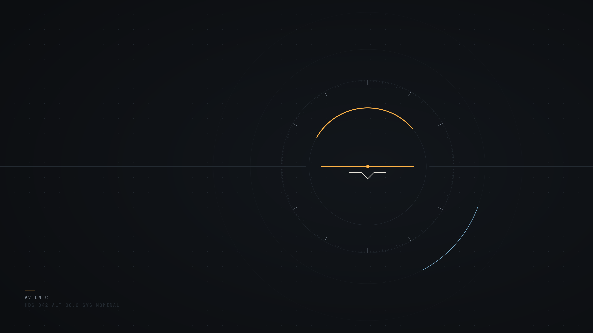

# Avionic

A cockpit-instrument Hyprland desktop for Arch Linux. Dark graphite panels, 1px rules, square corners, no blur, and one amber readout: the active workspace and the focused window. Everything else stays quiet.



## Install

```sh
curl -fsSL https://raw.githubusercontent.com/AlfaPigeon/avionic/main/install.sh | bash
```

Pass options after `bash -s --`:

```sh
curl -fsSL https://raw.githubusercontent.com/AlfaPigeon/avionic/main/install.sh | bash -s -- --sddm --shell fish
```

| Option | What it does |
| --- | --- |
| `--no-packages` | Skip pacman/AUR. Only link configs and apply the theme |
| `--sddm` | Install and enable SDDM (off by default) |
| `--wlogout` | Use wlogout (AUR) as the power menu instead of the built-in rofi one |
| `--shell fish\|zsh` | Install that shell and make it your login shell (off by default) |
| `--dry-run` | Print every step, change nothing |
| `-y`, `--yes` | Accept defaults without asking |

> **Heads-up:** the package step runs `sudo pacman -Syu --needed …`, so it **upgrades your whole system** before installing (Arch does not support partial upgrades). Use `--no-packages` to skip it, or `--dry-run` to see every command first.

The installer refuses to run as root and checks for pacman. It installs from the official repos only, clones the repo to `~/.local/share/avionic` (or updates it), backs up existing configs to `~/.local/state/avionic/backups/<timestamp>/`, and symlinks ours into `~/.config`, so `git pull` updates them. It also enables PipeWire, NetworkManager and Bluetooth. You can run it again safely.

Start the desktop with `start-hyprland` on a TTY, or pick **Hyprland** in SDDM.

## Targets

Built for **Hyprland 0.56.2**, which uses the **Lua config** (`hyprland.lua`). The old `hyprland.conf` format is deprecated. Hyprland-side syntax used here:

- `hl.window_rule` / `hl.layer_rule` with `match = { … }` (not `windowrulev2`)
- `hl.gesture({ fingers = 3, direction = "horizontal", action = "workspace" })` (not `workspace_swipe`)
- `hyprctl dispatch 'hl.dsp.dpms({ action = "off" })'` (Lua dispatchers) in hypridle and the power menu
- Waybar uses the generic `ext/workspaces` module for now. Waybar 0.15's `hyprland/workspaces` still sends old-style dispatches that the Lua config rejects, so clicking a workspace would do nothing. Once a Waybar release ships the Lua-compatible fix, switch back to `hyprland/workspaces` in `config/waybar/config.jsonc` (the CSS already targets `#workspaces`).

The other tools are hyprlock 0.9, hypridle 0.1.8, hyprpaper 0.8 (`wallpaper { }` blocks), hyprpolkitagent 0.2, Waybar 0.15, rofi 2.0 (native Wayland), swaync 0.12 and swayosd 0.3.

## What's included

| Area | Tool |
| --- | --- |
| Compositor | Hyprland, xdg-desktop-portal-hyprland + gtk, hyprpolkitagent |
| Bar | Waybar: workspaces, window title, clock + calendar, audio, network, Bluetooth, battery (hidden on desktops), CPU/RAM, tray, notifications, power |
| Launcher, menus | rofi: apps, clipboard, power menu, keybind list |
| Notifications | swaync (SUPER + N) |
| On-screen display | swayosd for volume and brightness keys |
| Lock & idle | hyprlock + hypridle: dim 2.5 min, lock 5 min, screen off 5.5 min, suspend 30 min |
| Wallpaper | hyprpaper, Designer's `assets/wallpapers/avionic.png` (SVG source alongside), also the lock screen background |
| Terminal | kitty |
| Files | Thunar (+ gvfs, archive and volume plugins) |
| Screenshots | grim + slurp, swappy for edits, saved to `~/Pictures/Screenshots` and copied |
| Clipboard | cliphist + wl-clipboard |
| Color picker | hyprpicker |
| Media | playerctl, brightnessctl, wpctl/WirePlumber, pavucontrol |
| Network | NetworkManager + nm-applet, BlueZ + Blueman |
| Look | GTK (adw-gtk3 + nwg-look), Qt (qt6ct, qt5/qt6-wayland), Papirus icons, IBM Plex Sans (UI) + JetBrainsMono Nerd Font (bar, terminal, readouts) |

## Keybinds

`SUPER + F1` shows every bind in a searchable list.

| Keys | Action |
| --- | --- |
| `SUPER + Return` | Terminal |
| `SUPER + Space` | App launcher |
| `SUPER + E` | File manager |
| `SUPER + V` | Clipboard history |
| `SUPER + N` / `SUPER + SHIFT + N` | Notification center / do not disturb |
| `SUPER + L` | Lock |
| `SUPER + Escape` | Power menu |
| `SUPER + Q` | Close window |
| `SUPER + F` / `SUPER + M` | Fullscreen / maximize |
| `SUPER + T` | Toggle floating |
| `SUPER + C` | Center floating window |
| `SUPER + P` / `SUPER + J` | Pseudo-tile / toggle split |
| `SUPER + G` / `SUPER + Tab` | Toggle group / next in group |
| `SUPER + R` | Resize mode (arrows, Esc to leave) |
| `SUPER + ←↑→↓` | Move focus |
| `SUPER + SHIFT + ←↑→↓` | Move window |
| `SUPER + CTRL + ←↑→↓` | Swap window |
| `SUPER + 1…0` | Go to workspace 1–10 |
| `SUPER + SHIFT + 1…0` | Move window to workspace |
| `SUPER + ALT + 1…0` | Send window to workspace, stay here |
| `SUPER + [` / `]`, `SUPER + scroll` | Previous / next workspace |
| `SUPER + S` / `SUPER + SHIFT + S` | Scratchpad / move window there |
| `SUPER + drag` / `SUPER + right-drag` | Move / resize window |
| `Print` / `SHIFT + Print` | Screenshot area / screen |
| `SUPER + Print` | Screenshot area into the editor |
| `SUPER + SHIFT + C` | Color picker |
| `SUPER + SHIFT + R` / `SUPER + SHIFT + B` | Reload Hyprland / restart Waybar |
| Media keys | Volume, mic, brightness (with OSD), play/pause/next/prev |

The keyboard layout is set at the top of `config/hypr/hyprland.lua` (default `us`, use `tr` for Turkish). Put monitors and anything machine-specific in `~/.config/hypr/user.lua` (see `user.lua.example`).

## Theme

Everything visual comes from **one file: `theme/palette.sh`**. It holds 15 colors (6-digit hex), two fonts, a size, radius, border, gaps, the GTK/icon/cursor theme names and the wallpaper path. The Avionic defaults:

| Role | Key | Value |
| --- | --- | --- |
| Background | `bg` | `#0C0E11` |
| Bar / panels | `bg_alt` | `#101317` |
| Surface | `surface` | `#15191E` |
| Border (every rule) | `overlay` | `#232A31` |
| Text / secondary / muted | `fg` / `fg_dim` / `muted` | `#E8E4DA` / `#B1B4B4` / `#7A848F` |
| Amber accent (active workspace, focused border) | `accent` | `#FFB347` |
| Info, used sparingly | `accent_alt` | `#7FB7D9` |
| Warning / urgent | `warning`, `urgent` | `#F25C54` |
| Quiet status and terminal tones | `success`, `ansi_*` | sage, ochre, violet, teal |
| Fonts | `font_ui`, `font_mono` | IBM Plex Sans, JetBrainsMono Nerd Font |
| Shape | `radius`, `border` | `0`, `1` |

```sh
$EDITOR ~/.local/share/avionic/theme/palette.sh
~/.local/share/avionic/scripts/apply-theme.sh --reload
```

`apply-theme.sh` renders every `theme/templates/<app>/<file>.tmpl` into `config/<app>/<file>`. Rendered files are git-ignored. Templates use:

- `{{name}}` for any palette value, for example `{{font_ui}}` or `{{radius}}`
- `{{color}}` → `#0c0e11`, `{{color.hex}}` → `0c0e11`, `{{color.rgb}}` → `12, 14, 17`

Unknown placeholders and malformed colors fail loudly. `--check` renders into a temp dir as a dry run. To restyle a component, edit its template. To recolor everything, edit only the palette. Optional: `scripts/make-wallpaper.sh` draws a simple abstract wallpaper from the palette (needs ImageMagick) into `assets/wallpapers/generated.png`; point `wallpaper=` at it if you want it.

## Layout

```
install.sh  uninstall.sh
config/<app>/        static configs, symlinked into ~/.config (+ rendered theme files)
theme/palette.sh     the single source of truth
theme/templates/     themed files with {{placeholders}}
scripts/             apply-theme, screenshots, clipboard, power menu, keybind list, links.conf
assets/wallpapers/   avionic.png (default) + avionic.svg
```

## Uninstall

```sh
~/.local/share/avionic/uninstall.sh
```

This removes only the symlinks that point into the repo and restores the most recent backup. Packages, services and the repo stay. The script prints how to remove the repo.

## License

[MIT](LICENSE) © 2026 AlfaPigeon
